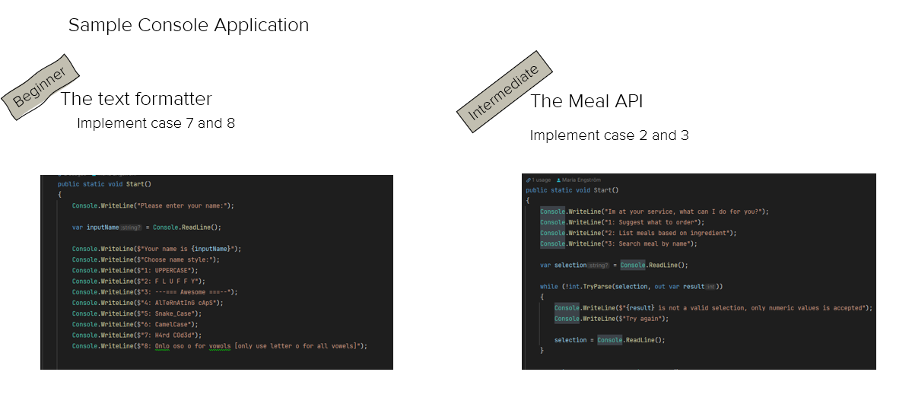
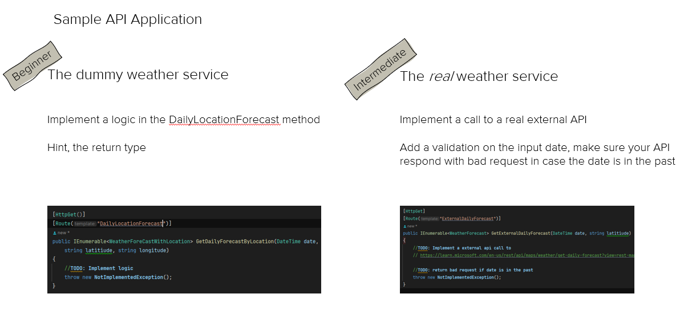
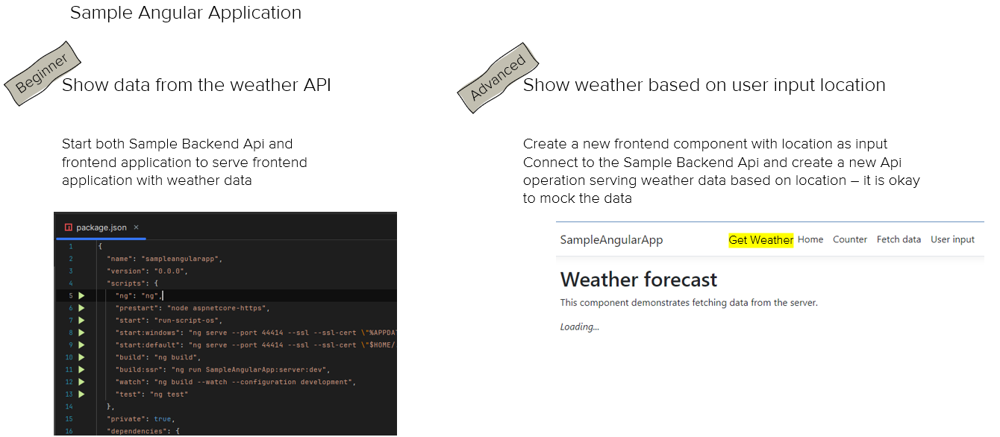

# dotnet workshop

## Prerequisites

* A computer with `Windows 🪟`, `Mac OS 🍎` or `linux 🐧`
* 🧑‍💻 [dotnet 7 SDK from Microsoft](https://dotnet.microsoft.com/en-us/download/dotnet/7.0)
* 📃 Text editor | IDE - (choose your favourite)
  * [VS Code](https://code.visualstudio.com/) (also install the C# extension)
  * [Visual Studio](https://visualstudio.microsoft.com/)
  * [Rider](https://www.jetbrains.com/rider/)
  * CLI and any text editor also works
* 🌿 [GIT](https://git-scm.com/)
* 💻 Command console (to setup project)
  * cmd
  * cmder
  * powershell
  * git bash
  * terminal
  * xterm
* 🟩 [Node.js](https://nodejs.org/en/) and 🅰[Angular CLI](https://angular.io/cli) (if you want to do frontend!)

> 🙏 Please make sure everything is installed before the workshop 

## Workshop

First decide what you want to build. There are several examples you can use as a starting point. Or you can just start from scratch if you want to.
Try to keep scope small as you won't have that much time during the workshop.

## Samples in this repository

### WebAPI

> `./SampleApiCallAll`

This application is a .NET Web API Application. The application follows the MVC pattern (Model-View-Controller), but does not have any views since it is purely a REST API.

The Controller `WeatherForecastController.cs` contains the code to handle incoming requests.

You can test the application by firing requests from a command line program like [curl](https://curl.se/) or a UI application like [Postman](https://www.postman.com/) if you prefer a more graphical approach.

Read more about this type of application in [Microsofts documentation](https://dotnet.microsoft.com/en-us/apps/aspnet/apis)

### Console application

> `./SampleConsoleApp`

This is a classic console application that you can run from a terminal like `cmd` or `windows terminal`.

The application integrates an API that can get different kind of meals for the user.

Read more about this type of application in [Microsofts documentation](https://learn.microsoft.com/en-us/dotnet/core/tutorials/with-visual-studio-code?pivots=dotnet-7-0)

### Frontend application (Angular)

> `./SampleAngularApp`

This is an Angular frontend application with a .NET C# backend server. Basically this is two applications, the angular app that runs in the browser of the user, and the .NET application that hosts the angular app, as well as an API that can be called from the frontend application to get/receive data.

Read more about angular in .NET in [Microsofts documentation](https://learn.microsoft.com/en-us/aspnet/core/client-side/spa/angular?view=aspnetcore-7.0&tabs=visual-studio)

> ❗Make sure nodejs is installed when running this application!

## Getting started with a sample

1. Clone the repository using git

> git clone ...
2. Now you have the code on your computer, open the directory of the repository in Visual Studio or VSCode
3. Build the Solution (a solution in .NET is a container for all the projects in the directory) you can use the shortcut `(Ctrl + Shift + B)` to build.
4. Run the application by pressing F5. You may need to change the starting application depending on what sample you want to work with

> ❗ Visual Studio: To change starting application in visual studio just right click the project and select "Set as startup project"

> ❗ VS Code: To change starting application in VSCode just click the directory symbol on the bottom left pane and select the application in the dropdown on top of the editor.

> ❗ Command line: To start a specific project, run the command with the project argument `dotnet run --project SampleConsoleApp/SampleConsoleApp.csproj`

## Guides

Get started with Visual Studio Code
https://learn.microsoft.com/sv-se/shows/dotnet/get-started-vscode-csharp-net-core-windows

## Tasks

Search in repo for *TODO* to find places where you can add new code.

